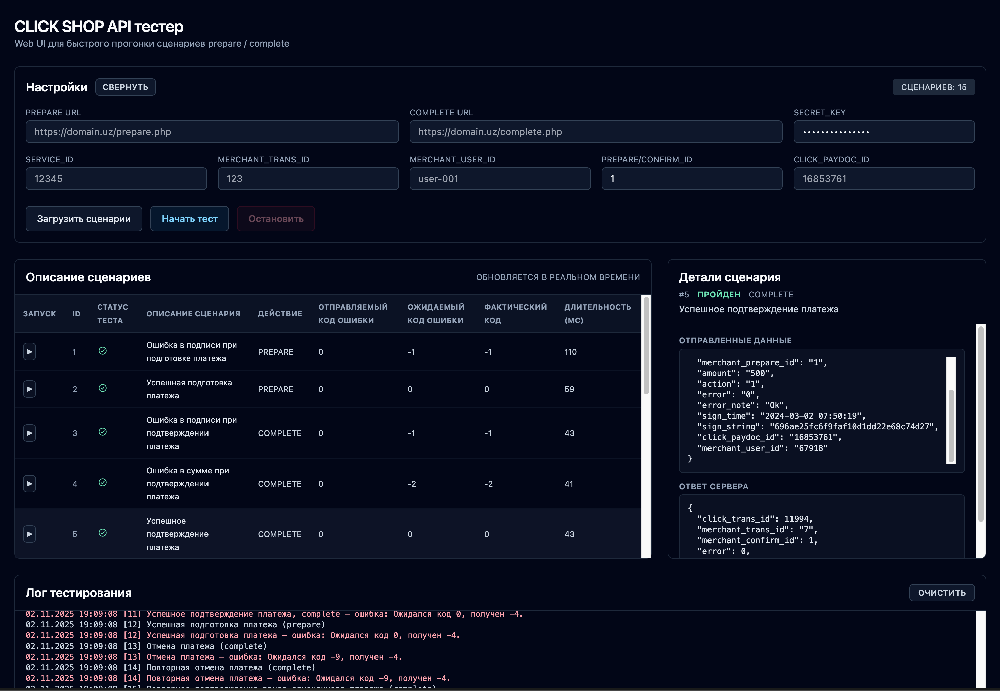

# ClickUz Tester Web UI

Modern web interface for testing [CLICK shop API](https://click.uz) scenarios. The project is inspired by the original CLI toolkit: <https://github.com/yetimdasturchi/clickuz-tester>.



## Features
- Tailwind‑styled React dashboard for prepare/complete scenario runs
- Scenario queue execution with realtime status, stop control, per-row manual run, and detailed request/response view
- Scenario Manager modal to create/edit/delete scenarios directly in UI
- Persistent tester settings and scenario list via `localStorage` (including initial auto-load from `public/template.json`)
- Shared `amount` override in settings (optional), with per-scenario `post` values still supported
- In-app log console with clear button and dev-time sync to `testing.log`
- HTTP request audit trail (template/scenario requests + responses/errors) stored locally for diagnostics
- Dynamic cross-origin proxy in dev mode (`/__tester/http-proxy`) to reduce browser CORS issues
- Works with the JSON template shipped in `public/template.json`, including template value references between scenarios

## Getting Started

### 1. Install dependencies
```bash
npm install
```

### 2. Run the dev server
```bash
npm run dev
```
Open `http://localhost:5173` in your browser.

### 3. Configure the tester
- Fill in API endpoints, credentials, and identifiers in the settings form
- Use the collapse toggle to hide the form once configured
- Load scenarios from the default template or provide your own
- Use `Менеджер сценариев` to update scenario descriptions, actions, expected codes, and raw `post` JSON
- During `npm run dev`, any cross-origin API URL from settings is sent via local Vite middleware (`/__tester/http-proxy`) to avoid browser CORS restrictions

### 4. Execute scenarios
- Click `Начать тест` to run the full queue sequentially
- Use the `▶` button on any row to run an individual scenario
- Watch the status icons and log console for results; click any row to inspect payload/response details

## Template JSON
`public/template.json` matches the structure from the original repository. Customize or replace it to reflect your own test definitions.

## Build & Deploy
- `npm run build` – create a production bundle
- `npm run preview` – preview the built assets locally

## License
This package is open-source and available under the MIT License. 🏆
